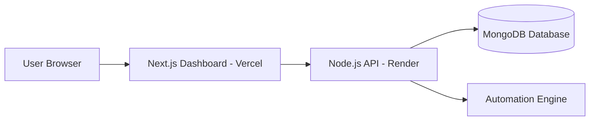

# 🚀 Lead Automation Platform

Production-ready **SaaS platform** for lead management and marketing automation.

This project demonstrates a real-world full-stack architecture using modern cloud deployment, secure authentication, and scalable API design.

---

## 🌐 Live Application

🖥 **Dashboard (Frontend — Vercel)**
https://lead-automation-dashboard.vercel.app

⚡ **Backend API (Render)**
https://lead-automation-platform.onrender.com

---

## 🧷 Deployment Status


---

## 🧠 Overview

Lead Automation Platform is a cloud-based SaaS application designed to:

* Manage leads efficiently
* Automate marketing workflows
* Provide scalable backend infrastructure
* Demonstrate production deployment practices

This repository represents **real SaaS engineering**, not a tutorial project.

---

## 🏗 System Architecture



### Architecture Highlights

* Decoupled Frontend & Backend
* REST API Architecture
* JWT Authentication
* Cloud Hosting
* Automation Event System
* Production Error Handling

---

## ⚙️ Tech Stack

### Frontend

* Next.js 14 (App Router)
* React
* Axios API Client
* TailwindCSS

### Backend

* Node.js
* Express.js
* MongoDB
* JWT Authentication
* Modular Architecture
* Event Listeners

### Cloud & DevOps

* Vercel Deployment
* Render Infrastructure
* GitHub Version Control
* Environment Variables Management

---

## ✨ Core Features

### 🔐 Authentication

* Secure login system
* JWT token validation
* Protected dashboard routes

### 📊 Dashboard

* Connected to production backend
* Persistent sessions
* API-driven UI

### 🤖 Automation Engine

* Event-based automation listeners
* Lead-triggered workflows
* Scalable background-ready structure

### 🧩 API Modules

* Auth Module
* User Module
* Lead Module
* Automation Module

---

## 🚀 Run Locally

### Clone Repository

```bash
git clone https://github.com/kelbyr061184-stack/lead-automation-dashboard
cd lead-automation-dashboard
```

### Install Dependencies

```bash
npm install
```

### Environment Variables

Create `.env.local`

```
NEXT_PUBLIC_API_URL=http://localhost:5000/api
```

### Start Development Server

```bash
npm run dev
```

---

## 🔐 Test User Example

Create a user via API:

```
POST /api/auth/register
```

Example credentials:

```
email: admin@test.com
password: 123456
```

---

## 📈 Project Goals

* SaaS-ready infrastructure
* Automation workflows
* Lead lifecycle management
* Cloud-native deployment
* Scalable backend foundation

---

## 🔮 Future Improvements

* Role-based permissions
* Automation visual builder
* Real-time updates (WebSockets)
* Analytics dashboard
* Subscription & billing system

---

## 🧑‍🚀 Developer

**Kelby — Full Stack Developer**

Specialized in:

* SaaS Platforms
* Cloud Architecture
* API Systems
* Automation Solutions
* Production Deployments

---

## ⭐ Portfolio Statement

This project represents a **production-level SaaS architecture** showcasing real deployment pipelines, authentication systems, modular backend design, and cloud-ready infrastructure.
