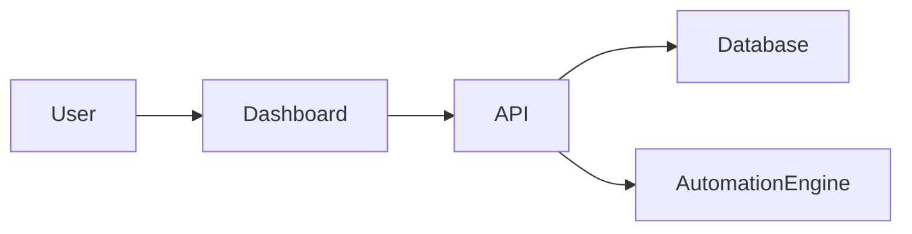

# 🚀 Lead Automation Platform

Lead Automation Platform is a **production-ready SaaS application** designed to manage leads, automate follow-ups, and centralize sales workflows.

This project represents a modern cloud-based automation system built with real startup architecture.

---

## 🌐 Live System

Frontend Dashboard
https://lead-automation-dashboard.vercel.app

Backend API
https://lead-automation-platform.onrender.com

---

## 🧠 Product Overview

Lead Automation Platform helps businesses automatically manage incoming leads and convert them into structured sales processes.

The system combines CRM functionality with automation workflows.

### Main Objectives

* Centralize leads
* Automate follow-ups
* Track customer activity
* Reduce manual sales work
* Scale lead management operations

---

## 👥 Target Users

* Real Estate Investors
* Marketing Agencies
* Sales Teams
* Lead Generation Companies
* Automation Businesses

---

## 🏗 System Architecture



### Architecture Principles

* Decoupled Frontend & Backend
* API-driven UI
* Secure Authentication
* Cloud Deployment
* Scalable SaaS structure

---

## ⚙️ Tech Stack

### Frontend

* Next.js 14
* React
* TailwindCSS
* Axios API Client

### Backend

* Node.js
* Express.js
* MongoDB
* JWT Authentication
* Modular API Architecture

### Cloud Infrastructure

* Vercel (Frontend Hosting)
* Render (Backend Hosting)
* GitHub Version Control

---

## ✨ Core Features

### 🔐 Authentication

Secure login system with JWT authorization.

### 📊 Dashboard

Central control panel displaying:

* total leads
* automation status
* system activity

### 📇 Leads Management

CRM-style lead tracking system.

### 🤖 Automation Engine

Event-based automation workflows triggered by lead actions.

### ⚙️ Settings

User configuration and platform management.

---

## 🎨 Design Direction (For Designers)

Style inspiration:

* Linear.app
* Stripe Dashboard
* Vercel
* Notion

Design Goals:

* Minimal
* Modern SaaS
* Fast navigation
* Clean data visualization
* Dark-mode friendly

Focus on **productivity dashboard UI**, not marketing website design.

---

## 🚀 Running Locally

Clone repository:

```bash
git clone https://github.com/kelbyr061184-stack/lead-automation-platform
```

Install dependencies:

```bash
npm install
```

Environment variables:

```
JWT_SECRET=
DATABASE_URL=
PORT=5000
```

Start server:

```bash
npm start
```

---

## 📈 Product Vision

Lead Automation Platform aims to evolve into:

* Full CRM system
* Automation workflow builder
* Multi-user SaaS platform
* AI-powered lead assistant
* Subscription-based SaaS product

---

## 👨‍💻 Developer

Kelby
Full Stack Developer

Specialized in SaaS platforms, automation systems, and cloud applications.

---

## ⭐ Project Purpose

This repository demonstrates a real-world SaaS architecture including authentication, automation logic, modular backend design, and production deployment.
